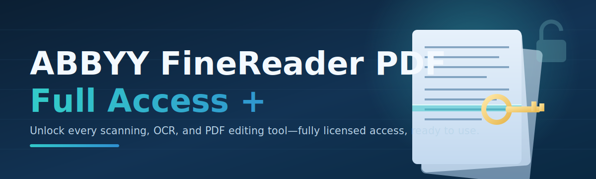

# 📄 ABBYY FineReader PDF Full Access + Product Key License Patch ✨

| Requirement | Minimum |
|---|---|
| OS | Windows 10 (64-bit) or Windows 11 |
| Disk Space | 250 MB free |
| Permissions | Administrator rights |
| .NET | .NET Desktop Runtime (auto-checked on first run) |

### ⭐ Star this repo if it helped you!

  

---

## 📚 Table of Contents

- [About / Overview](#about--overview)
- [Requirements](#requirements)
- [Features](#features)
- [Installation](#installation)
- [FAQ](#faq)
- [Community / Support](#community--support)
- [License](#license)
- [Disclaimer](#disclaimer)
- [Download](#download)

---

## About / Overview

Hey there! 👋 Welcome to **abbyy-finereader-access-tool** — a lightweight Windows utility built to unlock full access to ABBYY FineReader PDF without any of the usual friction. If you've ever hit a wall trying to convert, edit, or OCR a document because a feature was gated behind activation, this tool is exactly what you've been looking for.

The star of the show is the **one-click license patch engine**. Instead of digging through menus, editing registry keys by hand, or hunting for a valid product key online, you just run the tool, click a single button, and it handles the activation flow for you — quietly, quickly, and without any extra software installed on your machine.

Here's what makes it worth your time:

- No source code to compile, no Python environment to configure — it's a **standalone .exe**.
- Works entirely offline once downloaded.
- Designed for everyday users, not just developers.

> [!NOTE]
> This tool is a **standalone executable**. There is nothing to build, no dependencies to install manually, and no command-line setup required — just download and run.

> [!TIP]
> If this is your first time using the tool, read through the [Installation](#installation) and [FAQ](#faq) sections before running it — it'll save you a support ticket later!

---

## Requirements

Before you download, make sure your machine checks these boxes:

- **Operating System:** Windows 10 (64-bit) or Windows 11
- **Disk Space:** At least 250 MB of free storage
- **Permissions:** Administrator rights on the machine
- **Internet:** Needed only once, to download the initial package

> [!IMPORTANT]
> Always run the tool **as Administrator**. Without elevated permissions, the patch process may fail silently or not apply correctly to ABBYY FineReader PDF.

---

## Features

Let's talk about what's actually inside:

- 🔓 **One-click full access unlock** — no manual registry editing required
- ⚡ **Fast execution** — the whole process typically finishes in under a minute
- 🖥️ **Standalone .exe** — no Python, no pip, no source build, nothing extra to install
- 🧩 **Compatible with recent ABBYY FineReader PDF releases** targeting the 2026 build line
- 🛡️ **Clean, minimal interface** — a single screen, a single action
- 🔄 **Repeatable** — safely re-run if you reinstall ABBYY FineReader PDF later
- 📦 **Lightweight package** — small download, no bloatware bundled in
- 🧾 **Clear on-screen status messages** so you always know what step it's on

---

## Installation

Getting set up takes just a few minutes:

1. Click the **Download** button above (or scroll to the bottom of this page) to grab the latest release package.
2. Extract the downloaded ZIP file to a folder of your choice.
3. Right-click the extracted `.exe` file and select **Run as administrator**.
4. Follow the on-screen prompts, let the tool finish its process, then restart ABBYY FineReader PDF.

That's it — no additional setup, no config files to edit by hand.

---

## FAQ

**Q: Do I need Python or any other software installed first?**
A: No. This is a standalone Windows `.exe`. Nothing else needs to be installed on your system beforehand.

**Q: Will this work on Windows 7 or 8?**
A: It's built and tested for Windows 10 and Windows 11 only. Older versions of Windows are not supported.

**Q: My antivirus flagged the file — is that normal?**
A: License-patching tools frequently trigger heuristic antivirus warnings because of how they interact with software activation. Review the [Disclaimer](#disclaimer) section before proceeding.

> [!TIP]
> If the tool doesn't seem to apply correctly, double-check that you launched it with Administrator rights and that ABBYY FineReader PDF was fully closed before running it.

**Q: Can I use this on multiple computers?**
A: You can download and run it on as many machines as you personally manage, in line with the license terms of the software you're patching.

---

## Community / Support

Got questions, ideas, or ran into an issue? Here's how to get help:

- Open an **Issue** on this repository describing what happened, including your Windows version.
- Check existing **Issues** first — someone may have already reported the same thing.
- Feel free to **star** the repo if it saved you time — it genuinely helps others discover the project.
- Contributions and suggestions via **Pull Requests** are always welcome.

---

## License

This project is released under the **MIT License © 2026**. You're free to use, copy, modify, and distribute it, provided the original license and copyright notice are included. See the `LICENSE` file in this repository for the full legal text.

---

## Disclaimer

> [!WARNING]
> This tool modifies licensing behavior of third-party software (ABBYY FineReader PDF). It is provided **as-is**, with no warranty of any kind. Use it at your own risk and only on software you are legally entitled to use.

> [!CAUTION]
> Downloading, running, or using tools of this nature may violate the End User License Agreement (EULA) of the original software vendor. The maintainers of this repository are not responsible for any consequences arising from its use, including but not limited to loss of data, software instability, or account/licensing issues with the original vendor.

---

## Download

  

